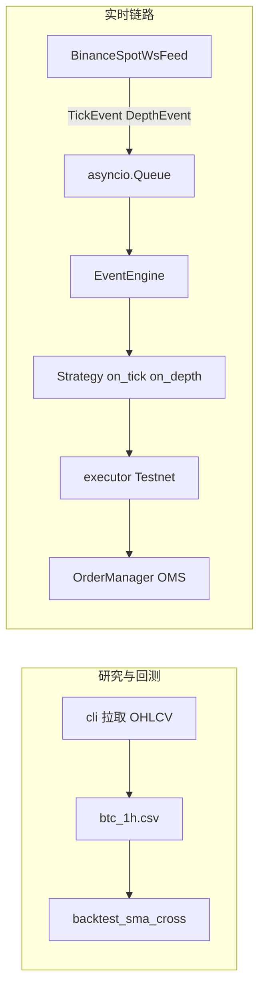

# binance-ohlcv-fetcher

Binance BTC/USDT 现货量化研究与模拟交易骨架：历史数据 → 回测 → 实时行情 → 事件引擎 → 下单执行 → 订单管理（OMS）。

> **定位说明**：本模块为教学/研究用骨架，**非生产级交易系统**。上线实盘前须自行补齐风控、监控、User Data Stream、幂等与对账等能力。

---

## 目录

- [系统架构](#系统架构)
- [项目结构](#项目结构)
- [环境与安装](#环境与安装)
- [快速上手](#快速上手)
- [模块使用说明](#模块使用说明)
- [典型工作流](#典型工作流)
- [注意事项](#注意事项)
- [常见问题](#常见问题)

---

## 系统架构



| 层次 | 组件 | 职责 |
|------|------|------|
| 数据层 | `cli` / `fetcher` / `cleaner` | REST 拉取历史 K 线，清洗落盘 |
| 研究层 | `backtest_sma_cross` | Backtrader 双均线回测 |
| 行情层 | `ws_spot_feed` + `events` | WebSocket aggTrade + depth10 |
| 调度层 | `event_engine` | 从 Queue 取事件，分发给 handler |
| 执行层 | `executor` | Testnet 市价全仓买/卖 |
| 订单层 | `oms` | 本地订单状态机与回报处理 |

---

## 项目结构

```
binance-ohlcv-fetcher/
├── src/binance_ohlcv/
│   ├── events.py           # TickEvent / DepthEvent
│   ├── ws_spot_feed.py     # WebSocket 行情 + 断线重连
│   ├── event_engine.py     # 事件驱动引擎
│   ├── strategies/
│   │   └── dummy.py        # 示例策略（仅打日志）
│   ├── oms/
│   │   ├── order.py        # Order + 状态机
│   │   └── manager.py      # OrderManager + OrderUpdateEvent
│   ├── cli.py              # 历史 K 线 CLI
│   ├── fetcher.py          # 分页拉取 + 重试
│   ├── cleaner.py          # 数据清洗
│   ├── client.py           # 主网 ccxt（只读）
│   ├── network.py          # 代理探测
│   └── executor.py         # Testnet 下单
├── backtest_sma_cross.py     # SMA 回测脚本
├── data/                     # CSV 输出（git 忽略）
├── requirements.txt
├── pyproject.toml
└── README.md
```

**配置与密钥**不在本目录，统一使用仓库根目录：

```
script/config/.env          # 本地密钥（勿提交）
script/config/.env.example  # 模板
```

---

## 环境与安装

### 前置要求

- Python **3.10+**
- 可访问 Binance API（国内/WSL 通常需配置代理）
- 回测绘图需 `matplotlib`；WSL 下建议 `--no-plot` 或保存 HTML

### 安装依赖

在仓库根目录 `script/` 下执行：

```bash
pip install -r binance-ohlcv-fetcher/requirements.txt
# 开发模式（可选，便于 import）
pip install -e binance-ohlcv-fetcher
```

### 配置密钥与代理

```bash
cp config/.env.example config/.env
```

编辑 `config/.env`：

```bash
# Testnet 模拟盘（仅 executor 需要）
BINANCE_TESTNET_API_KEY=your-testnet-api-key
BINANCE_TESTNET_API_SECRET=your-testnet-api-secret

# 网络代理（可选）
# CRYPTO_PROXY_URL=http://127.0.0.1:7890
# CRYPTO_NO_PROXY=1
```

| 变量 | 必填 | 说明 |
|------|------|------|
| `BINANCE_TESTNET_API_KEY` | 下单时 | [Testnet](https://testnet.binance.vision/) 申请 |
| `BINANCE_TESTNET_API_SECRET` | 下单时 | 与 Key 配对 |
| `CRYPTO_PROXY_URL` | 否 | HTTP 代理，WSL 访问 Binance 常用 |
| `CRYPTO_NO_PROXY` | 否 | `1` 强制直连 |

### 运行方式约定

下文命令均在 **`script/` 根目录**执行，并设置：

```bash
export PYTHONPATH=binance-ohlcv-fetcher/src
```

---

## 快速上手

按顺序体验完整链路：

```bash
# 1. 拉取一年 BTC/USDT 1h K 线
python -m binance_ohlcv

# 2. SMA 双均线回测（输出夏普、回撤、收益率）
python binance-ohlcv-fetcher/backtest_sma_cross.py --no-plot

# 3. WebSocket 行情演示（15 秒）
python -m binance_ohlcv.ws_spot_feed

# 4. 事件引擎 + 示例策略（15 秒）
python -m binance_ohlcv.event_engine

# 5. OMS 状态机演示
python -m binance_ohlcv.oms.manager

# 6. Testnet 模拟下单（需 config/.env 中配置密钥）
python -c "from binance_ohlcv.executor import execute_order; execute_order('buy')"
```

---

## 模块使用说明

### 1. 历史 K 线拉取

```bash
python -m binance_ohlcv
python -m binance_ohlcv --days 180 --output binance-ohlcv-fetcher/data/btc_1h.csv
```

- 默认：BTC/USDT、1h、365 天 → `data/btc_1h.csv`
- 自动分页、限频等待、网络指数退避重试
- CSV 列：`timestamp`, `datetime`, `open`, `high`, `low`, `close`, `volume`

### 2. SMA 双均线回测

```bash
python binance-ohlcv-fetcher/backtest_sma_cross.py
python binance-ohlcv-fetcher/backtest_sma_cross.py --csv path/to.csv --no-plot
```

| 参数 | 默认 |
|------|------|
| 快线 / 慢线 | MA20 / MA50 |
| 初始资金 | 10,000 USDT |
| 手续费 | 0.1% |
| 信号 | 金叉全仓多，死叉全仓空 |

### 3. WebSocket 实时行情

```python
import asyncio
from binance_ohlcv.events import TickEvent, DepthEvent, MarketEvent
from binance_ohlcv.ws_spot_feed import BinanceSpotWsFeed

async def main():
    queue: asyncio.Queue[MarketEvent] = asyncio.Queue(maxsize=10_000)
    feed = BinanceSpotWsFeed(queue, symbol="BTC/USDT")
    stop = asyncio.Event()
    await feed.run(stop)

asyncio.run(main())
```

- 订阅：`btcusdt@aggTrade` + `btcusdt@depth10@100ms`
- 断线后 1s 起指数退避重连，上限 60s

### 4. 事件引擎（EventEngine）

```python
from binance_ohlcv.event_engine import EventEngine
from binance_ohlcv.events import TickEvent, DepthEvent
from binance_ohlcv.strategies.dummy import DummyStrategy

engine = EventEngine(queue)
engine.register_strategy(DummyStrategy())  # 绑定 on_tick / on_depth
# 或: engine.register_handler(TickEvent, my_handler)
await engine.run()
```

### 5. Testnet 下单（executor）

```python
from binance_ohlcv.executor import execute_order

execute_order("buy")   # 全部 USDT 市价买入 BTC
execute_order("sell")  # 全部 BTC 市价卖出
```

| signal | 行为 |
|--------|------|
| `buy` | `quoteOrderQty` 市价买入 |
| `sell` | 市价卖出全部 BTC 余额 |

### 6. 订单管理（OMS）

```python
from binance_ohlcv.oms import (
    Order, OrderManager, OrderSide, OrderStatus, OrderUpdateEvent,
)

oms = OrderManager()
oms.register_order(Order(
    order_id="10001", symbol="BTCUSDT", side=OrderSide.BUY,
    price=73000.0, quantity=1.0, status=OrderStatus.SUBMITTED,
))
oms.on_order_update(OrderUpdateEvent(
    order_id="10001",
    status=OrderStatus.PARTIAL_FILLED,
    filled_quantity=0.4,
))
```

订单状态：`PENDING` → `SUBMITTED` → `PARTIAL_FILLED` → `FILLED` / `CANCELED`（终态不可再变）。

---

## 典型工作流

### 仅做策略研究

```
拉取 K 线 → backtest_sma_cross → 调参 / 换周期
```

### 模拟盘联调（目标架构）

```
ws_spot_feed → EventEngine → 你的策略
                              ↓ 产生信号
                         executor (Testnet)
                              ↓ 回报（待接 User Data Stream）
                         OrderManager.on_order_update
```

当前 **executor 与 OMS 尚未自动串联**；实盘级系统需自行订阅 Binance User Data Stream，将 `executionReport` 转为 `OrderUpdateEvent` 喂给 OMS。

---

## 注意事项

### 安全与合规

1. **切勿将 API Key / Secret 提交到 Git**  
   只写在 `config/.env`；不要创建名为 `API Key` 的文本文件，不要贴在终端截图或聊天记录中。
2. **Testnet ≠ 主网**  
   `executor` 使用 `set_sandbox_mode(True)`，仅访问模拟盘；误用主网密钥需自行承担风险。
3. **密钥泄露**  
   若曾泄露，立即在 Testnet / 主网控制台**作废并重新生成**。

### 网络与环境

4. **代理**  
   WSL2 下访问 Binance 常需 `CRYPTO_PROXY_URL`（见 `phase5_crypto/proxy_config.py`）。WebSocket 走直连 `stream.binance.com`，与 REST 代理策略可能不同。
5. **WSL 绘图**  
   `backtest_sma_cross` 弹窗可能失败，请使用 `--no-plot`。
6. **队列积压**  
   `asyncio.Queue` 默认有界；行情过快而策略过慢时会阻塞 WS 协程，应监控 `queue.qsize()` 或降采样。

### 回测与实盘差异

7. **Backtrader 整数仓位**  
   BTC 单价高，脚本将价格 ÷1000（1 单位 = 0.001 BTC）以适配整数股；PnL 等价，但滑点/资金费率未完全建模。
8. **回测 ≠ 未来收益**  
   历史 SMA 交叉结果仅供研究，不构成投资建议。
9. **全仓市价**  
   `execute_order` 为演示级「全仓买卖」，无止损、无限价、无仓位比例控制。

### 工程局限（已知缺口）

10. 未实现：User Data Stream、订单与策略的闭环、主网实盘、风控、持久化、多标的组合。
11. OMS 与 executor 分离，需自行对接成交回报。
12. `DummyStrategy` 仅打印日志，不含真实交易逻辑。

---

## 常见问题

| 现象 | 处理 |
|------|------|
| `MissingCredentialsError` | 检查 `config/.env` 是否配置 `BINANCE_TESTNET_*` |
| `BinanceConnectivityError` | 配置代理或 `CRYPTO_NO_PROXY=1` 尝试直连 |
| `execute_order` 返回 None / 无成交 | Testnet 余额不足；先在网页领取测试 USDT |
| WS 连接慢 | 正常，国内需代理；观察日志「WebSocket 已连接」 |
| depth 解析警告（旧版） | 已修复；请拉取最新代码 |
| 演示结束 queue 剩余 >0 | 正常，取消任务时队列中或有未消费事件 |

---

## 相关模块（同仓库）

| 模块 | 说明 |
|------|------|
| [phase5_crypto/proxy_config.py](../phase5_crypto/proxy_config.py) | 代理自动探测 |
| [phase7_horizon/horizon.py](../phase7_horizon/horizon.py) | 港股 9660.HK 双均线回测 |
| [cpp_event_dispatcher](../cpp_event_dispatcher/) | C++ 高性能事件队列（可对标 EventEngine） |

## License

MIT
