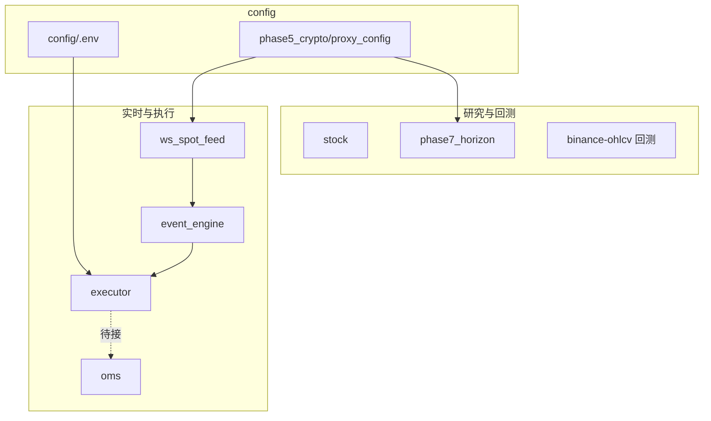

# 工程结构与使用说明

仓库路径：`/mnt/e/dev/biance/script`（WSL 下常见挂载路径）  
Git 远程：`Shawn-rgb/quantum-trading`

本文档汇总各子模块职责、目录结构、配置方式与常用命令，便于查阅与 onboarding。

---

## 一、仓库定位

这是一个 **量化研究与工具 monorepo**（单仓库、多子项目），大致分三类：

| 类型 | 代表目录 | 做什么 |
|------|----------|--------|
| **研究与回测** | `stock`、`phase7_horizon`、`binance-ohlcv-fetcher`、`vectorbt_demo` | 拉数据、算信号、回测、出 HTML 报告 |
| **自动化 / 实时** | `phase4_telegram`、`phase5_crypto`、`binance-ohlcv-fetcher` | 推送、采集、WebSocket、事件引擎、模拟盘 |
| **其他** | `cpp_event_dispatcher`、`ear_training_game` | C++ 事件队列、练耳小游戏 |

演进顺序见根目录 `README.md`（phase1 → phase7）。**新功能建议按主题建独立目录，密钥统一放在 `config/`。**

---

## 二、顶层目录结构

```
script/
├── config/                      # 全局配置（.env 本地，不提交 Git）
├── docs/                        # 文档（本文件）
├── requirements.txt             # 根目录常用 Python 依赖
├── README.md                    # 仓库总览
│
├── stock/                       # A 股 / 美股 Backtrader 回测
├── phase1/ ~ phase3/            # 早期探索、多策略融合
├── phase4_telegram/             # Telegram 每日信号
├── phase5_crypto/               # 币安雷达、代理、合约 WS 采集
├── phase6_btc/                  # BTC 价差等小工具
├── phase7_horizon/              # 9660.HK + CRCL 双均线波段回测
├── binance-ohlcv-fetcher/       # BTC 现货量化骨架（数据/回测/WS/引擎/Testnet/OMS）
├── vectorbt_demo/               # vectorbt 教程与 demo
├── cpp_event_dispatcher/        # C++ MPSC 事件分发器
└── ear_training_game/           # Streamlit 练耳
```

---

## 三、全局配置

### 3.1 密钥与环境变量

```bash
cd /mnt/e/dev/biance/script
cp config/.env.example config/.env
# 编辑 config/.env
```

| 变量 | 用途 | 使用模块 |
|------|------|----------|
| `TELEGRAM_BOT_TOKEN` | Telegram Bot | phase4_telegram |
| `TELEGRAM_CHAT_ID` | 推送目标 | phase4_telegram |
| `OPENAI_API_KEY` 等 | LLM | ear_training_game |
| `BINANCE_TESTNET_API_KEY` | 币安模拟盘 Key | binance-ohlcv-fetcher |
| `BINANCE_TESTNET_API_SECRET` | 币安模拟盘 Secret | binance-ohlcv-fetcher |
| `CRYPTO_PROXY_URL` | HTTP 代理 | Binance / yfinance |
| `CRYPTO_NO_PROXY` | 强制直连 | 同上 |
| `REDIS_URL` / `CH_*` | 存储 | futures_ws_collector |

加载逻辑：`config/env.py`（`load_project_env()`、`get_binance_testnet_credentials()` 等）。

### 3.2 网络代理

- 实现：`phase5_crypto/proxy_config.py`（自动探测 WSL/直连/代理）
- 复用：`binance-ohlcv-fetcher/src/binance_ohlcv/network.py`、`phase7_horizon`、`stock` 拉 yfinance 时

### 3.3 安全规范

- **切勿**提交 `config/.env`、API Key 文本文件、日志中的 Token
- **切勿**在代码或随意命名的文件中硬编码密钥
- 若密钥曾泄露，请在对应平台**立即轮换**并更新本地 `config/.env`
- `.gitignore` 已包含 `config/.env`、`**/API Key*` 等规则

---

## 四、各模块说明与用法

### 4.1 stock — 股票回测

| 文件 | 作用 |
|------|------|
| `get_stock_data.py` | yfinance（美股）/ akshare（A 股 6 位代码） |
| `backtest_left_side.py` | 左侧跌透 + MACD + 放量，Backtrader |

```bash
pip install -r requirements.txt
python -m stock.backtest_left_side --ticker 600519 --years 5
python -m stock.backtest_left_side --ticker AAPL --no-plot
```

---

### 4.2 phase7_horizon — 港股地平线 + 美股 CRCL 波段

| 文件 | 作用 |
|------|------|
| `horizon.py` | 9660.HK 日线 MA20/50 回测，Plotly HTML |
| `backtest_crcl_swing.py` | CRCL 波段双均线（默认 MA10/30） |
| `horizon_9660_daily.csv` | 地平线行情缓存 |
| `crcl_daily_cache.csv` | CRCL 行情缓存 |
| `horizon_backtest.html` | 地平线报告 |
| `crcl_swing_ma10_30.html` 等 | CRCL 波段报告 |

**CRCL 策略**：快线上穿慢线 → T+1 满仓做多；下穿 → T+1 清仓。手续费 0.1% + 滑点 0.05%。

```bash
# 地平线 9660.HK
python phase7_horizon/horizon.py
HORIZON_REFRESH=1 python phase7_horizon/horizon.py

# CRCL（Circle）
python phase7_horizon/backtest_crcl_swing.py
python phase7_horizon/backtest_crcl_swing.py --fast 20 --slow 50
python phase7_horizon/backtest_crcl_swing.py --refresh
python phase7_horizon/backtest_crcl_swing.py --no-html

# WSL 下一键用浏览器打开 HTML 报告
explorer.exe "$(wslpath -w /mnt/e/dev/biance/script/phase7_horizon/crcl_swing_ma10_30.html)"
```

---

### 4.3 binance-ohlcv-fetcher — BTC 现货量化骨架

**完整文档**：[binance-ohlcv-fetcher/README.md](../binance-ohlcv-fetcher/README.md)

#### 架构

```
历史研究:
  cli → data/btc_1h.csv → backtest_sma_cross.py

实时链路:
  ws_spot_feed → asyncio.Queue → event_engine → 策略 (on_tick/on_depth)
                                    ↓
                              executor (Testnet)
                                    ↓
                              oms (订单状态机，待接 User Data Stream)
```

#### 目录

```
binance-ohlcv-fetcher/
├── src/binance_ohlcv/
│   ├── cli.py, fetcher.py, cleaner.py    # 历史 K 线
│   ├── client.py, network.py             # ccxt + 代理
│   ├── ws_spot_feed.py, events.py        # WebSocket Tick/Depth
│   ├── event_engine.py                   # 事件引擎
│   ├── strategies/dummy.py               # 示例策略
│   ├── executor.py                       # Testnet 市价下单
│   └── oms/                              # 订单管理
├── backtest_sma_cross.py
└── data/btc_1h.csv
```

#### 常用命令

```bash
export PYTHONPATH=/mnt/e/dev/biance/script/binance-ohlcv-fetcher/src

pip install -r binance-ohlcv-fetcher/requirements.txt

# 拉取 BTC/USDT 1h 一年
python -m binance_ohlcv

# BTC SMA 回测
python binance-ohlcv-fetcher/backtest_sma_cross.py --no-plot

# WebSocket 行情演示（约 15 秒）
python -m binance_ohlcv.ws_spot_feed

# 事件引擎 + DummyStrategy
python -m binance_ohlcv.event_engine

# OMS 状态机演示
python -m binance_ohlcv.oms.manager

# Testnet 模拟下单（需 config/.env）
python -c "from binance_ohlcv.executor import execute_order; execute_order('buy')"
```

> **定位**：教学/研究骨架，非生产级系统。OMS 与 executor 尚未自动串联成交回报。

---

### 4.4 phase4_telegram — Telegram 每日信号

```bash
python phase4_telegram/tg_signal_bot.py
```

扫描 BTC/QQQ/GLD 等，波动率缩放仓位，推送 Telegram。

---

### 4.5 phase5_crypto — 币安生态

| 组件 | 作用 |
|------|------|
| `proxy_config.py` | 全项目代理探测（重要） |
| `crypto_finder.py` / `tg_whale_bot.py` | 山寨异动、巨鲸警报 |
| `futures_ws_collector/` | 合约 WS → Redis/ClickHouse |

```bash
python phase5_crypto/tg_whale_bot.py
```

---

### 4.6 phase6_btc

BTC 现货/合约价差等实验脚本（如 `btc_price_diff.py`），体量较小。

---

### 4.7 vectorbt_demo — vectorbt 学习

```bash
pip install -r vectorbt_demo/requirements.txt
python vectorbt_demo/run_all.py
```

输出：`vectorbt_demo/outputs/*.html`

---

### 4.8 cpp_event_dispatcher — C++ 事件队列

高性能 MPSC 队列，概念上对标 Python `event_engine`：

```bash
cd cpp_event_dispatcher
./scripts/bazel.sh test //...
```

---

### 4.9 ear_training_game — 练耳（非量化）

```bash
pip install -r ear_training_game/requirements.txt
streamlit run ear_training_game/app.py
```

---

## 五、推荐工作流

### 工作流 A：CRCL 波段研究

```bash
cd /mnt/e/dev/biance/script
python phase7_horizon/backtest_crcl_swing.py --refresh
python phase7_horizon/backtest_crcl_swing.py
explorer.exe "$(wslpath -w phase7_horizon/crcl_swing_ma10_30.html)"
```

### 工作流 B：BTC 研究 → 回测 → 模拟盘

```bash
export PYTHONPATH=binance-ohlcv-fetcher/src
python -m binance_ohlcv
python binance-ohlcv-fetcher/backtest_sma_cross.py --no-plot
# 配置 Testnet 密钥后
python -c "from binance_ohlcv.executor import execute_order; execute_order('buy')"
```

### 工作流 C：实时行情 + 事件引擎（不接真实下单）

```bash
export PYTHONPATH=binance-ohlcv-fetcher/src
python -m binance_ohlcv.event_engine
```

---

## 六、模块关系图



---

## 七、环境与安装（首次）

```bash
cd /mnt/e/dev/biance/script
cp config/.env.example config/.env

# 根目录常用包
pip install -r requirements.txt

# BTC 现货模块
pip install -r binance-ohlcv-fetcher/requirements.txt
```

要求：**Python 3.10+**，WSL 下访问 Binance/yfinance 通常需配置 `CRYPTO_PROXY_URL`。

---

## 八、注意事项

| 主题 | 说明 |
|------|------|
| WSL 绘图 | Backtrader 弹窗可能失败，用 `--no-plot` 或 Plotly HTML |
| 打开 HTML | `explorer.exe "$(wslpath -w 路径)"` |
| CRCL 样本 | IPO 后历史短，回测结论仅供参考 |
| binance-ohlcv | 非生产系统；实盘需风控、监控、对账 |
| 数据文件 | 大 CSV/HTML 多在本地生成，部分不入 Git |
| 队列积压 | 实时链路需关注 `asyncio.Queue` 深度 |

---

## 九、文档索引

| 文档 | 路径 |
|------|------|
| 仓库总览 | [README.md](../README.md) |
| BTC 现货模块 | [binance-ohlcv-fetcher/README.md](../binance-ohlcv-fetcher/README.md) |
| 环境变量模板 | [config/.env.example](../config/.env.example) |
| 本说明 | docs/工程说明.md |

---

*最后更新：与 binance-ohlcv-fetcher 实时链路、phase7 CRCL 波段回测、OMS 等模块同步。*
